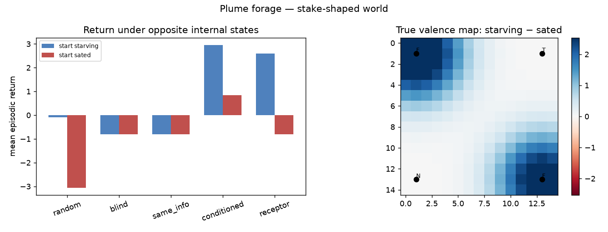

# RESULTS — plume forage (valence drives action in a world with stakes)

**The claim:** in a 2D chemical arena whose reward is homeostatic (satiety flip
on food; damage on toxin), a state-conditioned valence head produces better
behaviour than state-blind or same-info controls — same greedy actuator, only
the head changes.

## Arena

- 15×15 grid, 4 sources (2 food, 1 toxin, 1 neutral), Gaussian plumes
- Actions: N/S/E/W/stay/forage
- Reward on forage = concentration-weighted stake (food flips with satiety;
  toxin always bad)
- Policy: climb predicted valence; forage when local prediction ≥ threshold

## Headline numbers (seed 0, 20 episodes/condition)

| policy | return starve | return sated | food\|starve | food\|sated | toxin (mixed) |
|--------|-------------:|-------------:|-------------:|------------:|--------------:|
| random | −0.08 | −3.06 | 7.10 | 7.05 | 3.60 |
| blind | −0.80 | −0.80 | 0.00 | 0.00 | 0.00 |
| same-info | −0.80 | −0.80 | 0.00 | 0.00 | 0.00 |
| **conditioned** | **+2.96** | **+0.83** | **17.00** | **7.00** | **0.00** |
| **receptor** | **+2.60** | −0.80 | **16.00** | **0.00** | **0.00** |

## Read it

- Conditioned / receptor heads approach food when starving and cut food intake
  when sated (receptor abstains entirely when full).
- Blind and same-info never commit to foraging under the greedy threshold —
  without a usable stake signal they idle and pay step cost. Random forages
  blindly and eats toxin.
- Zero toxin forages for every valence-competent head.
- This is the behavioural half of the thesis: a live approach/avoid signal tied
  to something the system has reason to care about.

*Reproduce: `python experiments/plume-forage/run.py --plot`*

## Honest limits

Gaussian plumes, not turbulent CFD. Offline-fitted valence head + greedy
actuator, not deep RL. A rung on the environment ladder (see IDEAS.md), not the
top. The point is that stake-shaped valence changes *what the agent does* under
opposite internal states — measurable, reproducible, CPU-only.
