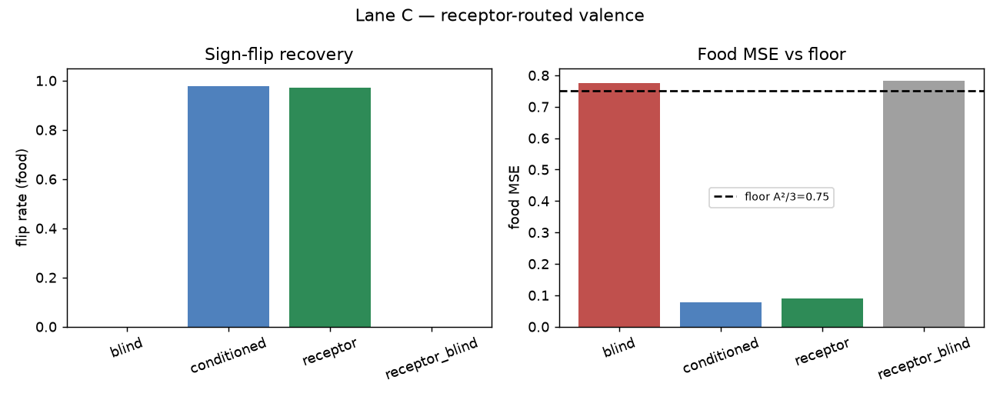

# RESULTS — receptor-route (Lane C)

**The claim:** routing valence through a receptor-binding layer
(`descriptors → softplus receptor population → valence × state`) preserves
state-flip capacity, and puts the thesis in the *architecture*: the valence head
never sees raw descriptors, only contact-shaped receptor activity.

## Headline numbers (synthetic, seed 0, K=64 receptors)

| metric | blind | conditioned | receptor | receptor-blind |
|--------|------:|------------:|---------:|---------------:|
| food MSE | 0.774 | 0.078 | **0.091** | 0.783 |
| flip rate (food) | 0.000 | 0.977 | **0.972** | **0.000** |

## Read it

- Receptor-routed + state matches the conditioned head (~97% flip, food MSE ~0.09).
- Receptor-routed *without* state collapses to the blind floor (flip 0.000).
- The binding layer is not a free lunch and not a spoiler — state is still the
  load-bearing channel; contact is the intermediate representation.

*Reproduce: `python experiments/receptor-route/run.py --plot`*
