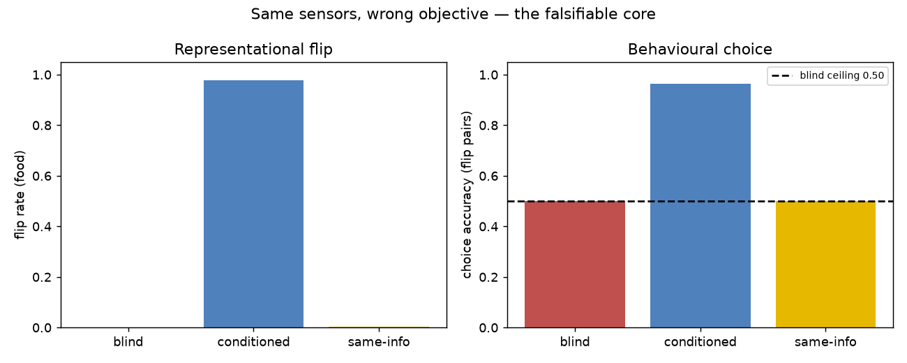

# RESULTS — same-info control (falsifiable core, 03 §5.2)

**The question:** does a grounded valence channel measurably change what a model
does versus a channel carrying the *same sensor bits* under a non-stake
objective?

Three heads, identical MLP capacity:

| head | input | target |
|------|-------|--------|
| state-blind | descriptors | y(m,s) |
| state-conditioned | descriptors + state | y(m,s) |
| **same-info control** | descriptors + state | E_s[y\|m] |

The control *sees* satiety. It is supervised on the state-averaged label. Optimal
behaviour under that objective is to ignore state. If it fails the flip while
the conditioned head succeeds, the result is not "need more features" — it is
"the learning signal must be stake-shaped."

## Headline numbers (synthetic, seed 0)

| metric | blind | conditioned | same-info |
|--------|------:|------------:|----------:|
| food MSE | 0.774 | **0.078** | 0.787 |
| flip rate (food) | 0.000 | **0.977** | **0.005** |
| choice accuracy (flip pairs) | 0.500 | **0.963** | **0.500** |
| choice regret (flip) | 0.490 | **0.024** | 0.507 |

## Read it

- Same-info ≈ blind on every flip metric. Access to internal-state bits is not
  enough.
- Conditioned recovers the flip in representation (~98%) and choice (~96%).
- The gap is the empirical shadow of "presence": stake-shaped supervision, not
  richer sensors.

*Reproduce: `python experiments/same-info/run.py --plot`*
