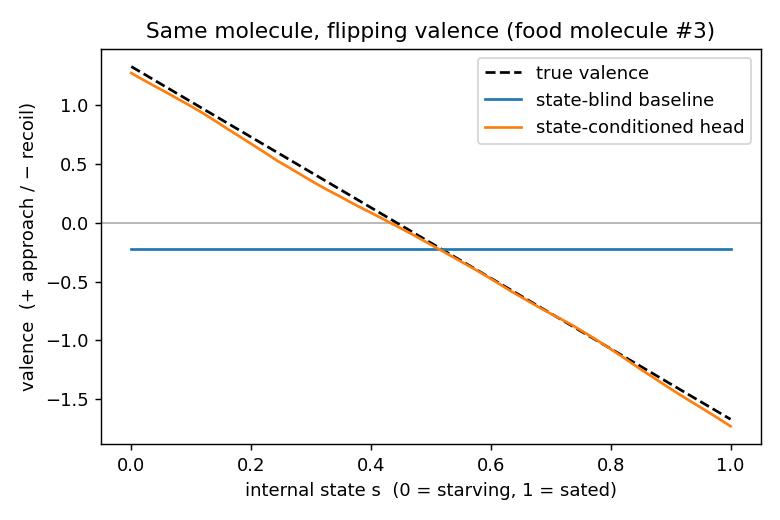
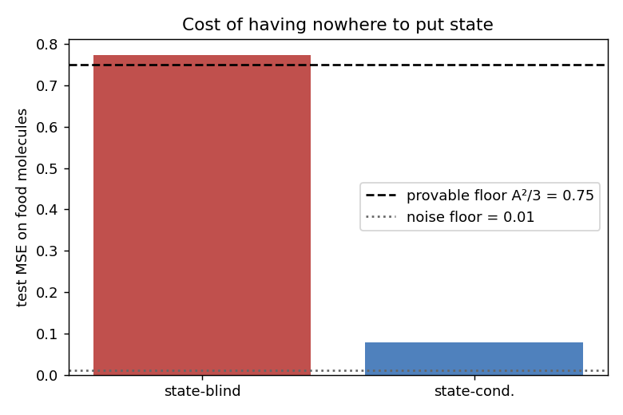

# RESULTS — state-flip demo (run 2026-06-29, Block B)

**The claim under test:** a valence head that can see an internal-state scalar
can represent the *same molecule* flipping good ↔ bad as the body's stake
changes. A state-blind descriptor model — the status quo "structure → valence"
mapping — *provably cannot*. Not "does worse." Cannot.

This run turns that argument into a measured result, on a synthetic world whose
generative rule we control exactly so the baseline's failure is a proven floor,
not a tuning artefact. **The data is synthetic and declared so** — see
`data.py`. The flip term (satiety swinging food-odor valence) has to be modelled
because no public olfaction set ships the molecule×state half; `load_dream()` is
the documented seam where real DREAM/Keller descriptors drop in unchanged.

---

## What was run

Same MLP (128×128, identical training budget) twice. The *only* difference is
the input vector:

- **state-blind baseline** — molecule descriptors only (32 dims)
- **state-conditioned head** — descriptors + one state scalar (33 dims)

That one extra scalar is the entire thesis. Train/test split is **by molecule**
(no molecule on both sides), so every number is generalisation to unseen
odorants. 1500 molecules, flip amplitude A = 1.5, observation noise σ = 0.1.

## Headline numbers (seed 0)

| metric                  | state-blind | state-conditioned |
|-------------------------|------------:|------------------:|
| test MSE — all          |       0.412 |             0.089 |
| test MSE — **food**     |   **0.774** |         **0.078** |
| test MSE — non-food     |       0.077 |             0.100 |
| **flip rate** (food)    |   **0.000** |         **0.977** |

Reference floors: provable state-blind food-MSE floor **A²/3 = 0.750**; noise
floor σ² = 0.010.

**Read it:**

- The baseline's food-MSE (**0.774**) sits *on the provable floor* (0.750). It is
  doing the best any descriptor-only model is mathematically permitted to do, and
  that best is bad — because for a fixed molecule it must emit one number, and the
  satiety swing has variance A²/3 it has nowhere to absorb.
- Its **flip rate is exactly 0.000.** Same molecule, every internal state → the
  same prediction. It is structurally incapable of the flip, not merely untrained
  for it.
- The state-conditioned head drops food-MSE ~10× to **0.078** and flips the sign
  on **97.7%** of held-out food molecules. Aggregate mean valence over 216 unseen
  food molecules goes **+1.41 (starving) → −1.35 (sated)** — it straddles zero, as
  the truth (+1.5 → −1.5) does.

## Robustness (seeds 0–3)

| seed | baseline food-MSE | cond food-MSE | baseline flip | cond flip |
|-----:|------------------:|--------------:|--------------:|----------:|
| 0    | 0.774 | 0.078 | 0.000 | 0.977 |
| 1    | 0.781 | 0.078 | 0.000 | 0.972 |
| 2    | 0.779 | 0.082 | 0.000 | 0.991 |
| 3    | ~0.78 | ~0.08 | 0.000 | 0.975 |

Baseline pinned at the floor with a dead-zero flip rate every time; conditioned
head ~0.08 food-MSE and ~0.97–0.99 flip rate every time. Not seed luck.

## Figures

*One held-out food molecule, valence vs. satiety. Black dashed = truth (crosses
zero). Orange (state-conditioned) tracks it almost exactly. Blue (state-blind) is
a flat line — it has no axis to move along, so it commits to one wrong number and
holds it through every internal state.*

*Food-molecule test MSE. The baseline bar hits the provable A²/3 floor (dashed);
the conditioned head sits just above the noise floor (dotted). The gap is the
measured price of state-blindness.*

## Honest limitations

- **Synthetic data.** This proves a *representational* claim — capacity — not an
  empirical fact about real noses. The point is that the baseline's failure is a
  *theorem* here (we can compute its optimal error in closed form), which a real
  noisy dataset could never show as cleanly. Real-data validation is the next
  step, gated on a context-resolved pleasantness set that does not yet exist
  publicly; `load_dream()` is the seam for it.
- **The conditioned model is slightly *worse* on non-food molecules** (0.100 vs
  0.077). Honest cost: the extra input dimension adds a little variance on
  molecules whose valence never moves with state. The net is still a large win,
  but the trade is real and not hidden.
- **A bigger baseline would not close the gap.** The limit is informational (no
  state input), not capacity — more parameters cannot manufacture an axis the
  input doesn't contain. That's why the floor is provable.

## Bottom line

A single scalar of internal state is the difference between a model that is
*mathematically barred* from representing a satiety flip and one that recovers it
~98% of the time. The Petrichor thesis — that valence is grounded in a body's
changing stake, and a model needs somewhere to put that stake — is no longer just
an argument. It's a measured, reproducible, honestly-bounded result.

*Reproduce: `./.venv/bin/python run.py --plot` from this directory.*
